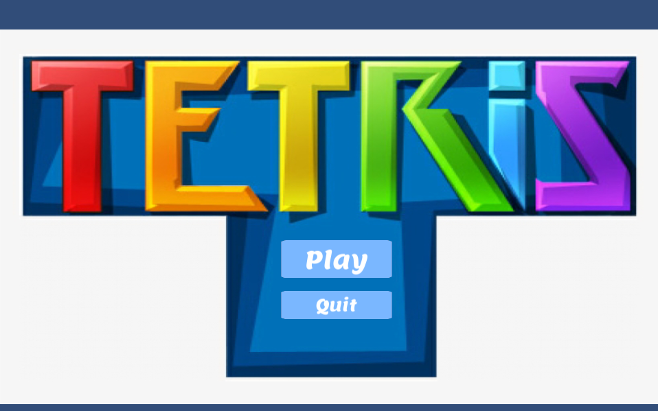
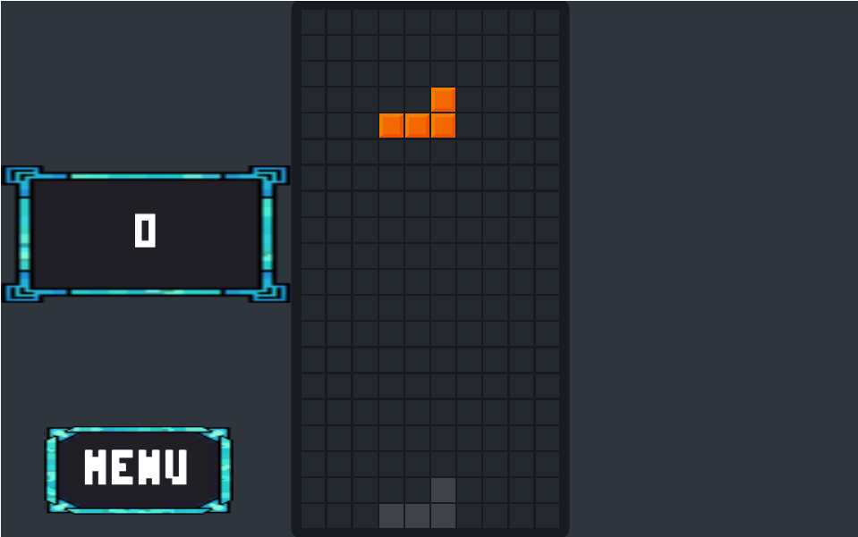
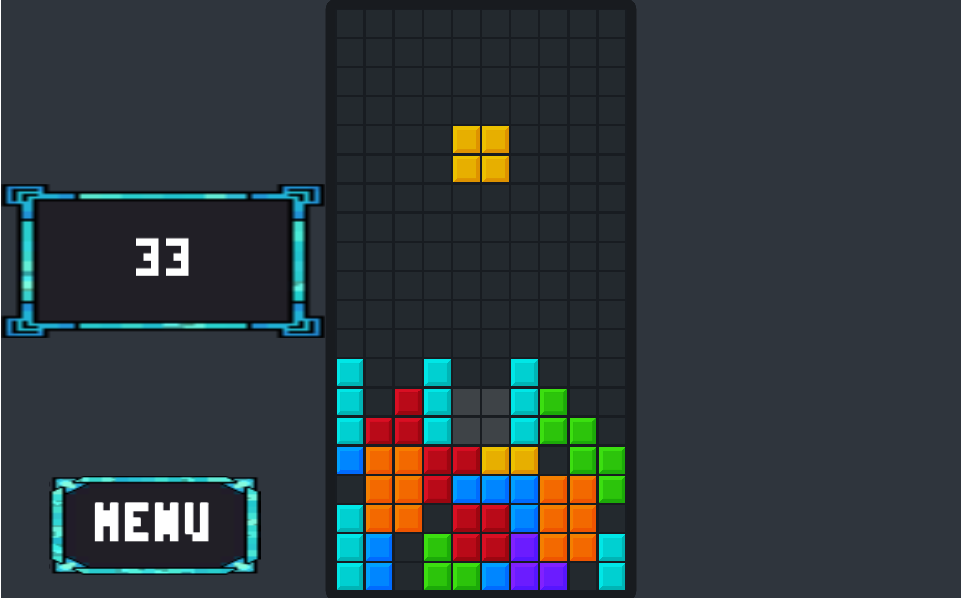
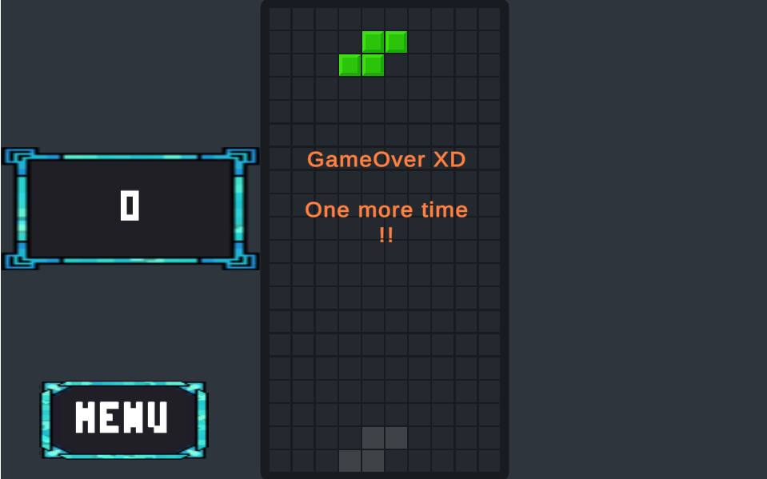

# Tetris
 A Tilemap Unity Tetris game.
 
 
 
### Gameplay
The starting menu loads first :

After clicking the start button, the game is loaded :

The game mechanics are simple:
* The "R" keyboard button rotates the tiles.
* Right mouse button: click from an initial position and release it in another one to move the tiles.
* Clicking the "Space" keyboard will significantly accelerate the fall of the tiles.
* For every line of tiles cleared,you get 1 point in the score.

The game is over when every row of the board has a tile and there is no more space to spread another tile on it.

